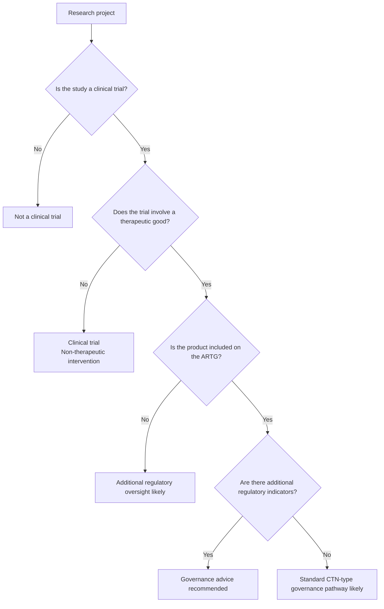

# Clinical Trial Governance Decision Tool

Decision-support tool to help researchers and administrators identify whether a proposed project is likely to be considered a **clinical trial** and whether **therapeutic goods regulatory considerations** may apply.

This tool provides structured guidance on when a study may involve a therapeutic good and helps flag circumstances where **Research Governance advice** or **TGA regulatory pathways (CTN/CTA)** may need to be considered.

> ⚠️ This tool provides **general guidance only** and does not replace formal ethics or regulatory review.

---

## Purpose

Universities and research institutions frequently receive early enquiries from researchers about whether their project may be a clinical trial and what governance steps may be required.

This tool helps to:

- identify potential **clinical trials**
- flag studies involving **therapeutic goods**
- highlight situations where **additional regulatory oversight** may apply
- encourage **early contact with Research Governance or the Ethics Office**

---

## Decision logic (simplified)

This structure helps researchers identify when **additional governance or regulatory consultation may be required**, without attempting to make formal regulatory determinations.

---

## Key features

The tool includes:

- a **step-through decision tree** for identifying clinical trials
- governance questions relating to **therapeutic goods**
- checks on whether a product is included on the **Australian Register of Therapeutic Goods (ARTG)**
- indicators of situations that may involve **additional regulatory oversight**
- outcome summaries describing typical **ethics and governance requirements**

The tool also links to relevant guidance from:

- the **Therapeutic Goods Administration (TGA)**
- institutional research ethics and governance guidance
- public clinical trial registries (e.g. **ANZCTR**)

---

## What the tool does not do

This tool does **not**:

- determine whether a study is formally classified as a clinical trial
- determine whether a **CTN (Clinical Trial Notification)** or **CTA (Clinical Trial Approval)** pathway applies
- replace **Human Research Ethics Committee (HREC)** review
- replace **Research Governance authorisation**
- provide regulatory advice

Researchers should contact their **Faculty research leadership or the Human Research Ethics Office** if they are unsure about the appropriate pathway.

---

## Intended users

This tool may be useful for:

- researchers planning new studies
- research administrators
- research governance staff
- ethics committee secretariats

It is particularly intended to support **early-stage project planning and triage**.

---

## Technical details

The tool is implemented as a **single-page HTML decision tree**, with the logic defined in a JavaScript object containing nodes and outcomes.

Advantages of this approach:

- simple to maintain
- easy to host on **GitHub Pages**
- portable between institutions
- no external libraries required

The decision logic can be updated simply by editing the node definitions.

---

## How to adapt this tool for other institutions

Institutions wishing to reuse or adapt this tool can typically do so with minimal changes.

### Institutional contact details

Update:

`human.ethics@scu.edu.au`

to the appropriate local ethics or research governance contact.

### Governance links

Replace links to institutional guidance, such as:

- ethics application pages
- governance procedures
- internal policy documents

### Outcome wording

Institutions may wish to adjust:

- outcome descriptions
- governance terminology
- contact instructions

to match local research governance processes.

### Regulatory guidance

The tool currently references:

- **Australian Register of Therapeutic Goods (ARTG)**
- **Clinical Trial Notification (CTN)**
- **Clinical Trial Approval (CTA)**

These are relevant only to institutions in Australia.

---

## Version

Version 0.1 — March 2026

Initial release including governance questions relating to **therapeutic goods** and **ARTG status**.

---

## Licence

This tool may be reused or adapted by other institutions for research governance purposes.
